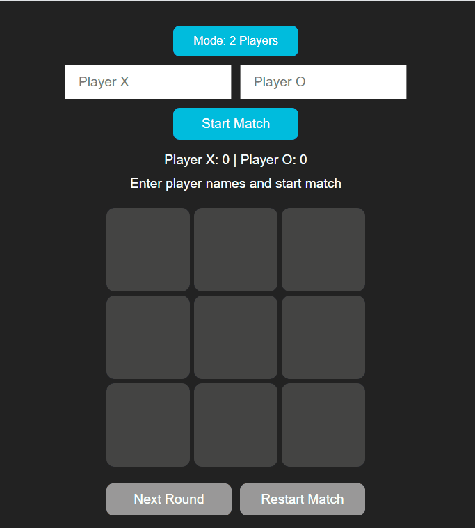

# 🎮 Tic Tac Toe Game
A simple, responsive Tic Tac Toe game built with HTML, CSS, and JavaScript.
Features 2-player mode and play against the computer with smart move logic.

## 🚀 Live Demo
Play it here:
[Tic Tac Toe Live](https://rytvee.github.io/tic-tac-toe/)

## 📌 Features
- ✅ 2 Player Mode – Play with a friend on the same device.
- 🤖 Computer Mode – Challenge an AI opponent.
- 🎨 Responsive Design – Works on desktop and mobile.
- 🔄 Restart & Next Round – Continue playing without reloading.
- 🏆 Score Tracking – Keeps track of wins and draws.

## 📂 Folder Structure
```text
tic-tac-toe/
│── index.html        # Main game layout
│── style.css         # Styling for the game board & UI
│── game.js           # Game logic (players, computer AI, score)
└── images/           # Icon, game play gif
```

## 🎮 How to Play
1. Choose Game Mode – Select 2 Player or Vs Computer.
2. Enter Player Names (if in 2 Player mode).
3. Start Playing – Take turns clicking empty cells.
4. First to 3 in a row (horizontal, vertical, or diagonal) wins!
5. Use Restart to reset the game or Next Round to keep scores.

## 🧠 Computer AI
The computer uses a basic strategy:
- Checks for winning moves.
- Blocks your winning moves.
- Chooses the best available space.

## 🎮 Game Play

**"2-Players" mode**


**"vs. computer" mode**


**Start, restart and end match**


## 📜 License
This project is free to use and modify.
